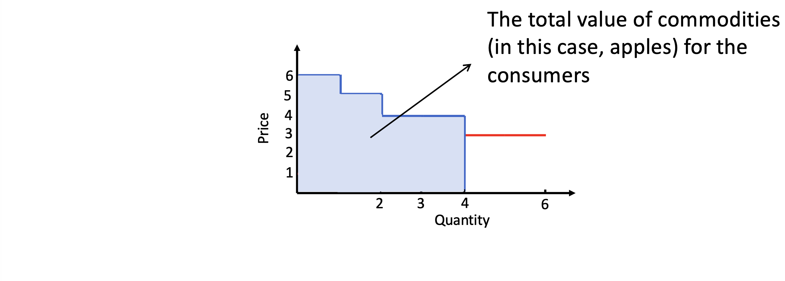
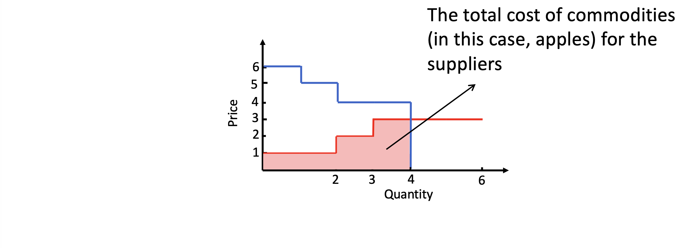
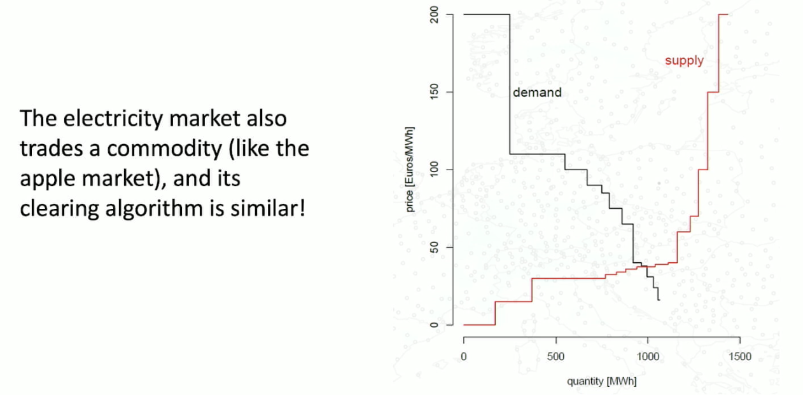

# power market mechanics
46755
Jalal Kazempour (DTU), Spring 2025 semester

## introduction 

### electric power systems
	- generators (conventional (choal, gaz) or renewable (solar farms, wind etc))
    - transmission (high, low, medium -voltage)
    - demands (consumers)

2 ways to organize the electric power systems : centralized (no market) or on electricity market 

### the centralized power system (no market)

a single entity make all operational and planning decisions for the entire power system (needs a system operator).
operational decisions : decisions we take in real time or close future (exemple : for a specific time period how much each generator should produce (Gen X generate Y MW for Z timeframe), load curtailment (cut) )
planning decisions : decisions we take in long term plans

the system operator :
	- wants to min the operational cost. (To produce it costs). 
	- supply demand w/ minimal costs.
	- goal “to meet the entire demand by dispatching power generators across the network in a **feasible** and **cost-effective** manner"

feasible : work within constraints and with security (btw : security “n-1” scheduled in the system -- iven if 1 Gen is out it's still can deliver: some kind of redundancy)

### electricity market
Generators belong to different producers. (portfolio for producers). so the producer goal is to maximize profit by making optimal operation and planning decisions. → Multiple decision-makers involved (interacting w/ each other, decisions are not independent = game theory).

Planning decisions of producers : portfolios extension for exemple.

how it operates when having many ‘participants’ that makes their own profit-maximizing. 

electricity can't be stored at larger scale as of today. --> changing. possible to transform eklecricity unde other forms

###  market
supply-curve : a non decreasing curve so we rank sellers based on the based on the least-cost. “Merit order principle"

utility = value of product for a given buyer. = profit (value-cost)*qte [control that formula is correct ?]
demand curve ( non-increasing curve) 

intersection of the demand and supply curve : equilibrium price (**market-clearing**); carried by a market operator (non profitable) 

the area below the demand cruve = total value of utilities (or commodities), similarly represents the total cost for the demand curve area.
 

we want to increase blue, decrease red. leads to social welfare (surplus) area between supply curve and demand curve. by **maximizing social welfare**, the total value of commodities for consumersis maximized, while the total cost for suppliers is minimized—resulting insatisfaction for both the demand and supply sides.

equilibrium point = social welfare is maximized. market clearing price and quantity are determined. (terminology comes from game theory)
based on the equilibium point --> uniform price. qtes are traded at a determined price. and we pay all sellers at the same price. (electrcity markets are often not uniform pricing)

We do not want to supply all demand. E.g. in this case we see that the demand on the right hand side of the equilibirum (and below) exists but i do not supply. that demande is not willing to pay enough. No free market. 

renewable generators = operational cost = 0 
the gas market price influence what the supply price of the gas generators are willing to pay. 
 

pay-as-bid (other schema) : you pay whatever you bet for. (e.g. w/ wind farms)

in a perfect market, we bid the true op costs. it's  possible to bid negatives prices based on tarifs or government rules may support to balance out the low cost

electricity market is different from other commodity markets
- not possible to store on a large scale.
- electricity demand is highly inelastic to price (this is changing !) = people pay whatever the price 
- physics governed (kirchoff's, etc)
- remark : it's possible to transform/convert it to have it stored (e.g. hydrogen, heat). either convert back (efficiency losses) or use it = integrated energy grid or multi-carrier energy systems.

market clearing algorithms = finding equilibrium supply-demand. the market clearing outcomes are: clearing price ($/MWh), generation/consumption level of each producer/demand (MW)

offer and bids. generators submitt they willing pric to sell = offer, while bid for demand. 
